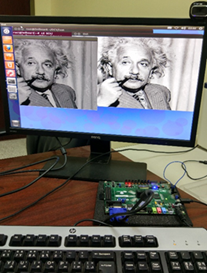

# Real-time Contrast Stretching IP Core  
  
* This core uses an online algorithm for contrast stretching i.e. the upper and lower limits of the contrast limited frames are progressively estimated and the stretching is applied in steps. With a step size of one, this means no more than 128 frames are required even for the most badly affected 8-bit frames.
* Use Simulink HDL coder to generate the Verilog Code for the IP.
* A pre-built bit stream for a minimal test hardware can be found in the Vivado project folder 'ZedMinSysHW' for Zedboard SOC platform. 
  
  
  

https://sites.google.com/view/4mbilal/

