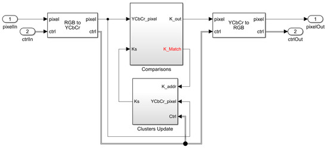

# Image/Frame Segmentation using Online K-Means Algorithm

* The Simulink model generates HDL files for K-means clustering IP core with AXI4 streaming interface.

* Two versions are provided: K=4 and K=8

* A pre-built bit file for testing on Zedboard SOC is avaialable in the Vivado project folder in the same repository

* Please cite this work as follows

Aiman Badawi and Muhammad Bilal, "High-Level Synthesis of Online K-Means Clustering Hardware for a Real-Time Image Processing Pipeline", Journal of Imaging, 2019, 5, 38.
https://www.mdpi.com/2313-433X/5/3/38

